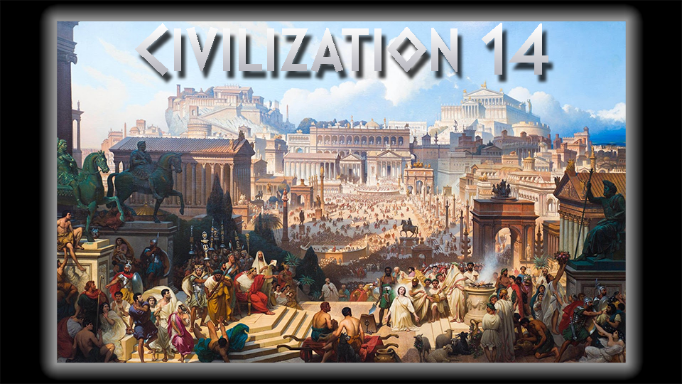

# Civilization 14

Welcome!

Civilization 14 (Civ14 for short) is a port of [Civilization 13](https://github.com/Civ13/civ13) from [BYOND](https://byond.com) to [Robust Toolbox](https://github.com/space-wizards/RobustToolbox), used for Space Station 14, which itself is a remake of SS13.

## What is this?

Civ14 is an immersive, player-driven strategy game, where history unfolds through the hands of its community. Set across vast timelines, from the dawn of civilization to the modern era, players take on roles as leaders, builders, warriors, or everyday citizens, shaping the course of their chosen society. Whether forging empires through diplomacy and trade, waging war to expand territory, or simply surviving in a dynamic, ever-evolving world, Civ14 offers a sandbox experience defined by cooperation, conflict, and creativity. With a passionate player base and a framework that rewards both individual ambition and collective storytelling, Civ13 transforms SS14 into a living tapestry of human history.

## Nomads

So far, we are working on the **Nomads** gamemode. You can see a guide to this [here](wiki/nomads.md).

## How to Play

Check [How to Play](wiki/playing.md) and the [Starter Guide](wiki/starter_guide.md.md).
