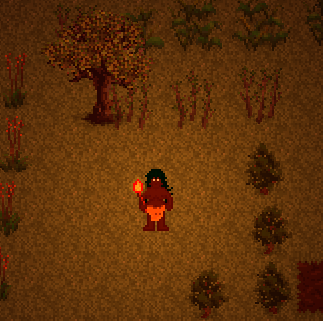
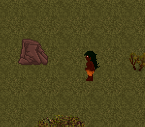
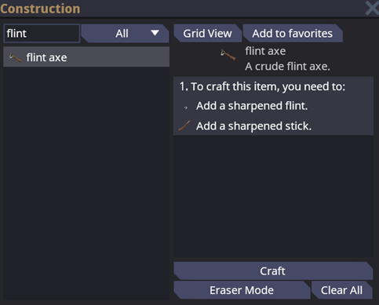
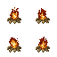
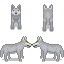
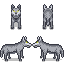
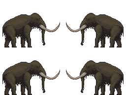
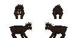

# Starter Guide

**Note: This guide mostly pertains to survival in the sandbox [Nomads](nomads.md) game mode.**

## Spawning in

-   You start out with nothing but age-appropriate clothes on your person and a torch in your pocket. If it is dark, drag the torch to your hand slot and press **Z** to turn it on.

    -   

-   If it's **winter season** or **Ice Age** map, you also spawn with a **fur coat**. Losing this will mean cold and miserable **death** in the icy outdoors.

-   Your **hunger** and **thirst** levels will both be at around 50%. You will get alerts if you get hungry or thirsty on the right side of the screen, below your health and stamina indicators. Keep an eye out for them.

-   Your first priority will be gathering flint to make a flint axe.

    -   Find a large rock or boulder and right-click on it. You should see an option to search for flint.
        
    -   Click the rock repeatedly with the flint to sharpen it (you will get a message when it is sharpened).
    -   Now go to a tree and right click on it. There should be an option to remove a branch from the tree, if there are any suitable ones available. This will pull a branch from the tree and place it on the ground.
    -   Click the branch with an empty hand on **Grab intent** to clear the leaves, then click again on **Harm intent** to pull out the twigs.
    -   Use the sharpened flint on the stick to sharpen it, then click the sharpened stick with the flint again to craft yourself a trusty flint axe, a tool and a weapon.
        

## Crafting Basics

### Crafting Menu

**Tip: Press G to open the crafting menu.**

You will need some basic things to survive. At the very start you will most likely be using **wood, leather, bone, stone, and straw** to make them.

-   Hit a tree with your flint hatchet until it breaks. You will then find some **wood** on the floor.

-   Hunt and butcher some animals to get **leather** and **bone**.

-   Use your knife on a grass tile to gather some **straw**.

-   Use your pickaxe on a rock tile to gather **stone** (see below).

### Mining 101

Ores are valuable crafting materials which you mine out of the rock.

-   You'll need **wood** and **bone** for this. Go gather them (bones are obtained by butchering animals - click the carcass with something sharp, like a flint axe or a knife),
-   Make a **bone pickaxe**.
-   Find a **rock** tile.
-   Right click on it while holding the **pickaxe** on your active hand.

## Food and Water

To survive, you will need to keep yourself nourished and warm. Pay attention to the alerts on the right side of the screen, they will tell you when you need to eat and drink.

**Warning: Letting either hunger or thirst reach 0% will cause your body to start shutting down, leading to inevitable death!**

### Hunger

The easiest way to get food early on is by killing animals and eating the meat after cooking it. Also, you can eat bird eggs, even uncooked!

-   Find an animal, preferably one that doesn't have fangs, claws, tusks, or poison. and kill it with any means (even bare fists work). Remember to press the **harm intent** button to enter combat mode!
     

**Tip: For now, stay away from bears, alligators, wolves, snakes, and mammoths. They will fight back and very probably kill you. Wait until you have proper equipment or a hunting party with you.**

-   Use your knife (flint axe works too) on the dead animal with **Harm intent** to butcher it.
-   **Raw meat** causes **food poisoning**! You'll want to **cook** it first, but if you're starving, food poisoning is the least of your worries.
-   To cook meat, place it on a **campfire** and click the campfire. The campfire is made with **wood logs**.

Farming is another good source of food (although not an immediate one) that does not involve getting maimed by wild animals. Check the [guide to farming](guide_to_farming.md).

### Thirst

The easiest way to quench your thirst early on is by drinking water or milk.

#### Water

You can get water from **puddles**, any **water tiles (except saltwater - do not drink nor boil it!)**, or **wells**.

-   To drink, you need to make a **mug** from **wood** or **drinking glass** from **glass**.
-   **Wells** have disease-free freshwater (**however, if there are some... excrements within 4 tiles of a well, the water becomes contaminated and unsafe to drink!)**. You can build them over a **puddle** by using with **stone**... if your faction has the research levels required.

#### Milk

-   Find a **cow**, **sheep ewe**, or **goat ewe**.
-   Make a **bucket** from **wood**.
-   Use the **bucket** on **Help intent** on the animal of choice to gather milk.
-   Pour the milk into the **mug** or **glass** and drink.
-   You don't have to boil milk.

Milk is regenerated in the animals over time, so keep them alive, and
you'll never go thirsty.

## Temperature

**Tip: Keep an eye out for the temperature alert! If it is flashing blue with a white snowflake, you are freezing! If it is red and there is sun instead, you are melting from the heat!**

Winter seasons can bring an icy chill that can seriously hurt and slow you down, or even kill you. Blizzards are especially deadly, and just wearing a fur coat will not cut it, so make sure you have a shelter ready before it is too late.

Southern climates could be merciless in their own way, so be careful that you do not overheat to the point of a heat stroke. Resting in a roofed shelter from time to time and wearing appropriate clothing (for instance, "traditional" desert clothes) can save you from fainting and shrivelling in a sweltering heat.

### Fur Clothing

Fur clothing can keep you warm in the winter, but it will not save you if you are caught in a blizzard. You can make fur clothing by skinning large furry animals like **bears** and **wolves**. Yes, you can finally skin furries with no repercussions.

-   Kill one of the following animals: **bear, wolf, bison, monkey, fox, sheep**.
-   Bucher the animal by using the **knife** on **Harm Intent**.
-   Collect enough pelts and craft **fur coat, boots, headcover and gloves** (you will need to hunt several animals for the whole set).

## Shelter

Shelter can save you from even the toughest of conditions.

Any roofed area is considered a shelter.

-   **Caves**: There's a reason that stone-age men were called cavemen. Look for entrances in rocks. If it has a roof, it will be darker inside. That means it will keep snow, cold, blazing sun and rain out. The easiest way of surviving inclement weather. Make sure that no bears live in the cave, though...
-   **Building a Roof**: Target your inner Bob the Builder and build your own roof.

    -   Build **walls** to prop the ceiling up. Craft floor tiles and place them to automatically build a roof overhead.

    -   You can also build walls with **dirt** or **snow** by using the **shovel** directly on the ground.

## Fire

Crackling fires will keep you warm even without a coat. Both campfires and braziers are refueled by adding **wood**, **coal** and **charcoal**. The brazier could also be refueled with **paper- and cloth-based items**.

-   A **campfire** warms you when you are right next to it, or within 2 tile.
-   A **brazier** (made with **stone**) provides more heat and warms you within 3 tiles.

## Dangerous animals

**Warning: The world is teeming with wildlife. Most of them are pretty tame and easy prey, but steer clear of the big game unless you're a skilled hunter, otherwise you'll become minced meat yourself!**

You want to avoid these, unless you're robust or need some pelts:

-   Bears (can provide fur)
-   Wolves (can provide fur)
-   Mammoths
-   Panthers, Jaguars, Lions, and other big cats
-   Alligators

## Night time

You'll need a light source to see in the night and in dark indoor areas. The basic source of light is the **torch**.

-   Gather some **wood**. Craft a **torch** and press **Z** to light it. Torches will last for **5 minutes** and then burn out.

-   For a static source of light, you can make a **campfire**, which will also help you cook some food.

-   You can also make lanterns with **iron**. Lanterns require fuel - any form of liquid fuel will do, like olive oil, fat, or petroleum.

-   For a more **permanent** light source, you can build **braziers** from **stone**. You can fuel it with any organic matter like wood or clothing - simply use items on the brazier.
